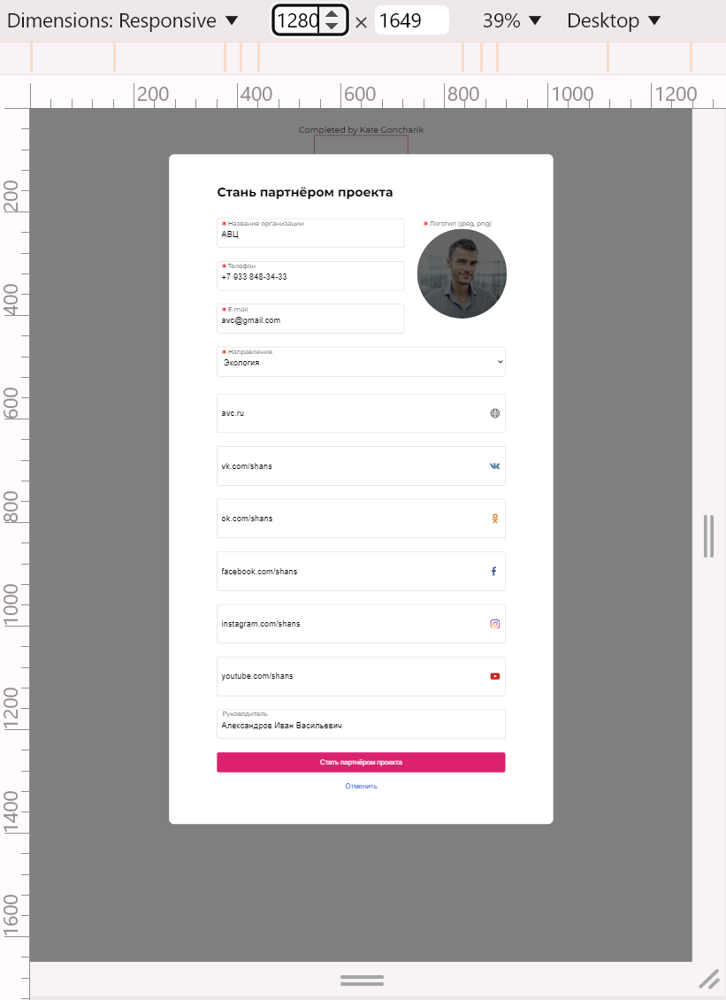
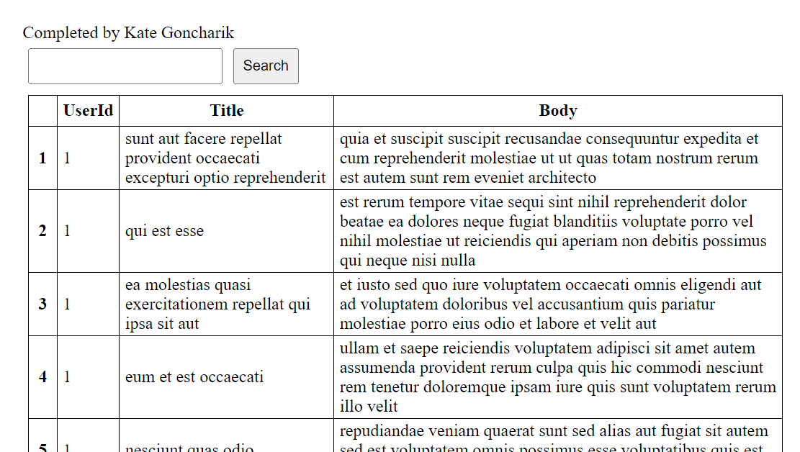
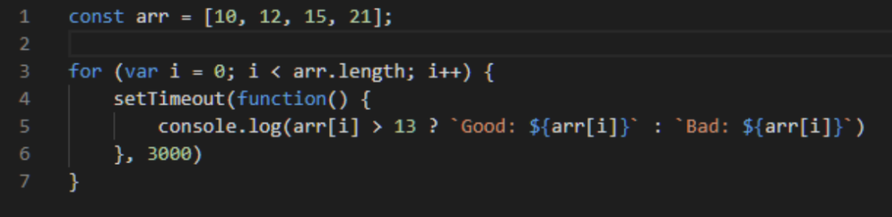

  
  
  <h1 align="center">Test task</h1>

<!-- TABLE OF CONTENTS -->

  
Table of Contents

  <ol>
    <li>
      <a href="#about-the-project">About The Project</a>
      <ul>
        <li><a href="#technology-stack">Technology stack</a></li>
      </ul>
    </li>
    </li>

  </ol>

<!-- ABOUT THE PROJECT -->

## About The Project

_Completed: August 2024_

Check out results

- [theory](https://github.com/KateGoncharik/coding-test-task/blob/theory-1/theory.md)
- [form](https://coding-test-task-form.netlify.app/)
- [simple render date into table](https://practice-2-table-generation.netlify.app/)
- [table with sorting and search](https://practice-3-table-sorting-search.netlify.app/)

#### Tasks

Часть 1 (Теория)

Написать что выводит данный код. Предложите 2 варианта модификации кода, чтобы ответ был следующим: Bad: 10, Bad: 12, Good: 15, Good: 21

Часть 2 (Практика)

1. Сверстать модальное окно, без использования сторонних библиотек. Внутри модального окна реализовать форму. Форма не должна быть доступна к отправке, если поля не заполнены, либо форма не валидна. Реализовать мобильную адаптацию. Реализовать возможность открыть/закрыть модальное окно на странице. Как плюс использование БЭМ-методологии. Дизайн формы в figma (см скриншот в ветке practice-1)

2. Реализовать JavaScript функцию, которая делает запрос к <https://jsonplaceholder.typicode.com/posts> и выводит на странице полученные данные в виде таблицы без использования сторонних библиотек.

3. Реализовать таблицу на основе полученных данных с <https://jsonplaceholder.typicode.com/posts> без использования сторонних библиотек. Добавить возможность сортировки по столбцам (при нажатии на название столбца строки таблицы сортируются по возрастанию, при повторном клике - по убыванию). Над таблицей вывести поисковую строку. При вводе данных (не менее 3-х символов) в поисковую строку производить фильтрацию таблицы (строки таблицы, данные которых не содержат подстроку, введённую пользователем, скрываются).

### Technology stack

[![NPM][NPM]][NPM-url]

[![Javascript][Javascript]][Javascript-url]

[![HTML5][HTML5]][HTML5-url]

[![CSS3][CSS3]][CSS3-url]

[![Prettier][Prettier]][Prettier-url]

[![Eslint][Eslint]][Eslint-url]

[![Netlify][Netlify]][Netlify-url]

(<a href="#readme-top">back to top</a>)

[NPM]: https://img.shields.io/badge/NPM-%23CB3837.svg?style=for-the-badge&logo=npm&logoColor=white
[NPM-url]: https://www.npmjs.com
[HTML5]: https://img.shields.io/badge/html5-%23E34F26.svg?style=for-the-badge&logo=html5&logoColor=white
[HTML5-url]: https://html.com/html5/
[Prettier]: https://img.shields.io/badge/prettier-1A2C34?style=for-the-badge&logo=prettier&logoColor=F7BA3E
[Prettier-url]: https://prettier.io/
[Eslint]: https://img.shields.io/badge/eslint-3A33D1?style=for-the-badge&logo=eslint&logoColor=white
[Eslint-url]: https://eslint.org/
[CSS3]: https://img.shields.io/badge/CSS3-1572B6?style=for-the-badge&logo=css3&logoColor=white
[CSS3-url]: https://ru.wikipedia.org/wiki/CSS
[Javascript]: https://img.shields.io/badge/JavaScript-323330?style=for-the-badge&logo=javascript&logoColor=F7DF1E
[Javascript-url]: https://developer.mozilla.org/en-US/docs/Learn/JavaScript/First_steps/What_is_JavaScript
[Netlify]: https://img.shields.io/badge/netlify-%23000000.svg?style=for-the-badge&logo=netlify&logoColor=#00C7B7
[Netlify-url]: https://www.netlify.com/
