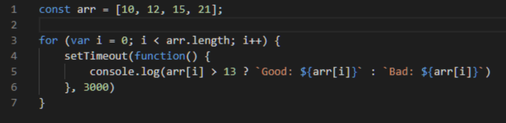

    <h1 align="center">Theory test task</h1>

<!-- TABLE OF CONTENTS -->

  
Table of Contents

  <ol>
    <li>
      <a href="#about-the-project">About The Project</a>
    </li>
  </ol>

<!-- ABOUT THE PROJECT -->

## About The Project

### _Theory test_

_Completed: August 2024_

Check out answer in theory.md

#### Task

Написать что выводит данный код. Предложите 2 варианта модификации кода, чтобы ответ был следующим: Bad: 10, Bad: 12, Good: 15, Good: 21

(<a href="#readme-top">back to top</a>)

